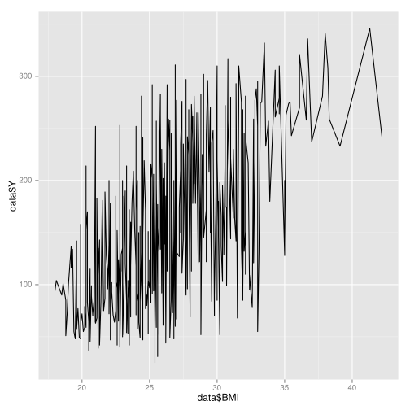
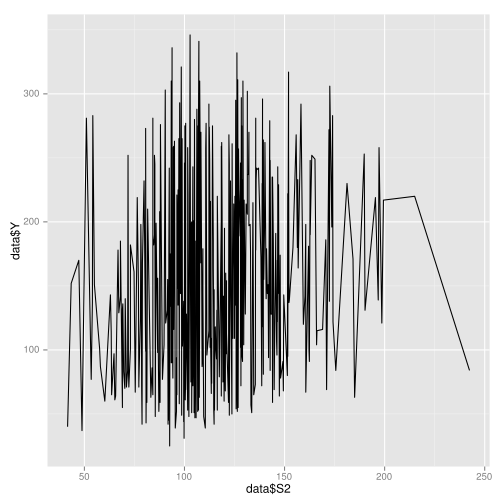
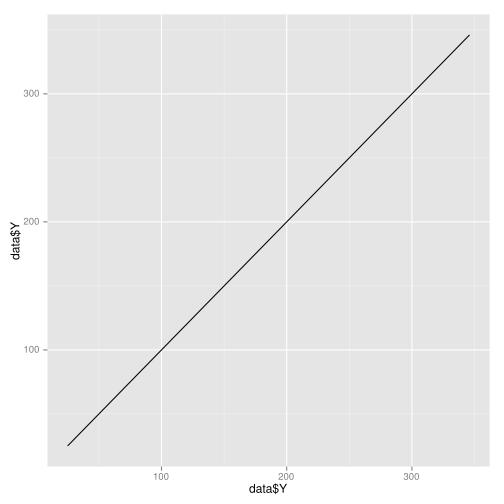

# Proyecto R - Diabetes
***
- Autor: Juan Antonio García Cuevas
- Fecha: 03/07/2016
***

**Con el conjunto de datos diabetes.data dplyr**:

## - Cargar las librerías


```R
library(ggplot2)
library(dplyr)
library(plyr)
```

    
    Attaching package: ‘dplyr’
    
    The following objects are masked from ‘package:stats’:
    
        filter, lag
    
    The following objects are masked from ‘package:base’:
    
        intersect, setdiff, setequal, union
    
    ------------------------------------------------------------------------------
    You have loaded plyr after dplyr - this is likely to cause problems.
    If you need functions from both plyr and dplyr, please load plyr first, then dplyr:
    library(plyr); library(dplyr)
    ------------------------------------------------------------------------------
    
    Attaching package: ‘plyr’
    
    The following objects are masked from ‘package:dplyr’:
    
        arrange, count, desc, failwith, id, mutate, rename, summarise,
        summarize
    


## - Cargar los datos en R.


```R
## Carga los datos del fichero
data <- read.table("diabetes.data", header=T)

## Muestra información (primeras filas, nº de filas y columnas, variables ...)
head(data)
str(data)
```


<table>
<thead><tr><th></th><th scope=col>AGE</th><th scope=col>SEX</th><th scope=col>BMI</th><th scope=col>BP</th><th scope=col>S1</th><th scope=col>S2</th><th scope=col>S3</th><th scope=col>S4</th><th scope=col>S5</th><th scope=col>S6</th><th scope=col>Y</th></tr></thead>
<tbody>
	<tr><th scope=row>1</th><td>59</td><td>F</td><td>32.1</td><td>101</td><td>157</td><td>93.2</td><td>38</td><td>4</td><td>4.8598</td><td>87</td><td>151</td></tr>
	<tr><th scope=row>2</th><td>48</td><td>M</td><td>21.6</td><td>87</td><td>183</td><td>103.2</td><td>70</td><td>3</td><td>3.8918</td><td>69</td><td>75</td></tr>
	<tr><th scope=row>3</th><td>72</td><td>F</td><td>30.5</td><td>93</td><td>156</td><td>93.6</td><td>41</td><td>4</td><td>4.6728</td><td>85</td><td>141</td></tr>
	<tr><th scope=row>4</th><td>24</td><td>M</td><td>25.3</td><td>84</td><td>198</td><td>131.4</td><td>40</td><td>5</td><td>4.8903</td><td>89</td><td>206</td></tr>
	<tr><th scope=row>5</th><td>50</td><td>M</td><td>23</td><td>101</td><td>192</td><td>125.4</td><td>52</td><td>4</td><td>4.2905</td><td>80</td><td>135</td></tr>
	<tr><th scope=row>6</th><td>23</td><td>M</td><td>22.6</td><td>89</td><td>139</td><td>64.8</td><td>61</td><td>2</td><td>4.1897</td><td>68</td><td>97</td></tr>
</tbody>
</table>


    'data.frame':	442 obs. of  11 variables:
     $ AGE: int  59 48 72 24 50 23 36 66 60 29 ...
     $ SEX: Factor w/ 2 levels "F","M": 1 2 1 2 2 2 1 1 1 2 ...
     $ BMI: num  32.1 21.6 30.5 25.3 23 22.6 22 26.2 32.1 30 ...
     $ BP : num  101 87 93 84 101 89 90 114 83 85 ...
     $ S1 : int  157 183 156 198 192 139 160 255 179 180 ...
     $ S2 : num  93.2 103.2 93.6 131.4 125.4 ...
     $ S3 : num  38 70 41 40 52 61 50 56 42 43 ...
     $ S4 : num  4 3 4 5 4 2 3 4.55 4 4 ...
     $ S5 : num  4.86 3.89 4.67 4.89 4.29 ...
     $ S6 : int  87 69 85 89 80 68 82 92 94 88 ...
     $ Y  : int  151 75 141 206 135 97 138 63 110 310 ...


## - Eliminar los missing values, que están codificados como -9999.00.


```R
# Muestra algunas filas en las que pueden verse algunos valores -9999.00 
print("Antes:")
data[c(18 : 20), 1 : ncol(data)]
dim(data)

# Reemplaza los valores -9999.00 por NA 
data[data == -9999 ] <- NA

# Muestra las filas anteriores después de la modificación
print("Después:")
data[c(18 : 20), 1 : ncol(data)]

# Elimina las filas con valores NA y muestra información del nuevo dataframe resultante
data <- na.omit(data)
print("Dimensiones del nuevo dataframe sin filas con valores NA:")
dim(data)
```

    [1] "Antes:"


<table>
<thead><tr><th></th><th scope=col>AGE</th><th scope=col>SEX</th><th scope=col>BMI</th><th scope=col>BP</th><th scope=col>S1</th><th scope=col>S2</th><th scope=col>S3</th><th scope=col>S4</th><th scope=col>S5</th><th scope=col>S6</th><th scope=col>Y</th></tr></thead>
<tbody>
	<tr><th scope=row>18</th><td>68</td><td>F</td><td>27.5</td><td>111</td><td>214</td><td>147</td><td>39</td><td>5</td><td>4.9416</td><td>91</td><td>144</td></tr>
	<tr><th scope=row>19</th><td>38</td><td>M</td><td>25.4</td><td>84</td><td>162</td><td>103</td><td>42</td><td>4</td><td>-9999</td><td>87</td><td>97</td></tr>
	<tr><th scope=row>20</th><td>41</td><td>M</td><td>24.7</td><td>83</td><td>187</td><td>108.2</td><td>60</td><td>3</td><td>4.5433</td><td>78</td><td>168</td></tr>
</tbody>
</table>


<ol class=list-inline>
	<li>442</li>
	<li>11</li>
</ol>


    [1] "Después:"


<table>
<thead><tr><th></th><th scope=col>AGE</th><th scope=col>SEX</th><th scope=col>BMI</th><th scope=col>BP</th><th scope=col>S1</th><th scope=col>S2</th><th scope=col>S3</th><th scope=col>S4</th><th scope=col>S5</th><th scope=col>S6</th><th scope=col>Y</th></tr></thead>
<tbody>
	<tr><th scope=row>18</th><td>68</td><td>F</td><td>27.5</td><td>111</td><td>214</td><td>147</td><td>39</td><td>5</td><td>4.9416</td><td>91</td><td>144</td></tr>
	<tr><th scope=row>19</th><td>38</td><td>M</td><td>25.4</td><td>84</td><td>162</td><td>103</td><td>42</td><td>4</td><td>NA</td><td>87</td><td>97</td></tr>
	<tr><th scope=row>20</th><td>41</td><td>M</td><td>24.7</td><td>83</td><td>187</td><td>108.2</td><td>60</td><td>3</td><td>4.5433</td><td>78</td><td>168</td></tr>
</tbody>
</table>


    [1] "Dimensiones del nuevo dataframe sin filas con valores NA:"


<ol class=list-inline>
	<li>433</li>
	<li>11</li>
</ol>


## - Ver el tipo de cada una de las variables.


```R
str(data)
```

    'data.frame':	433 obs. of  11 variables:
     $ AGE: int  59 48 72 24 50 23 36 66 60 29 ...
     $ SEX: Factor w/ 2 levels "F","M": 1 2 1 2 2 2 1 1 1 2 ...
     $ BMI: num  32.1 21.6 30.5 25.3 23 22.6 22 26.2 32.1 30 ...
     $ BP : num  101 87 93 84 101 89 90 114 83 85 ...
     $ S1 : int  157 183 156 198 192 139 160 255 179 180 ...
     $ S2 : num  93.2 103.2 93.6 131.4 125.4 ...
     $ S3 : num  38 70 41 40 52 61 50 56 42 43 ...
     $ S4 : num  4 3 4 5 4 2 3 4.55 4 4 ...
     $ S5 : num  4.86 3.89 4.67 4.89 4.29 ...
     $ S6 : int  87 69 85 89 80 68 82 92 94 88 ...
     $ Y  : int  151 75 141 206 135 97 138 63 110 310 ...
     - attr(*, "na.action")=Class 'omit'  Named int [1:9] 19 25 74 86 342 384 421 433 440
      .. ..- attr(*, "names")= chr [1:9] "19" "25" "74" "86" ...


## - Realizar un análisis estadı́stico de las variables: calcular la media, varianza, rangos, etc. ¿Tienen las distintas variables rangos muy diferentes?.


```R
summary(data)
print("Desviación típica:")
apply(data[-2], 2, sd)
print("Varianza:")
apply(data[-2], 2, var)
```


          AGE        SEX          BMI              BP               S1       
     Min.   :19.00   F:203   Min.   :18.00   Min.   : 62.00   Min.   : 97.0  
     1st Qu.:38.00   M:230   1st Qu.:23.10   1st Qu.: 84.00   1st Qu.:164.0  
     Median :50.00           Median :25.70   Median : 93.00   Median :186.0  
     Mean   :48.48           Mean   :26.35   Mean   : 94.65   Mean   :189.3  
     3rd Qu.:59.00           3rd Qu.:29.20   3rd Qu.:105.00   3rd Qu.:210.0  
     Max.   :79.00           Max.   :42.20   Max.   :133.00   Max.   :301.0  
           S2              S3              S4              S5       
     Min.   : 41.6   Min.   :22.00   Min.   :2.000   Min.   :3.258  
     1st Qu.: 95.4   1st Qu.:40.00   1st Qu.:3.000   1st Qu.:4.277  
     Median :113.0   Median :48.00   Median :4.000   Median :4.635  
     Mean   :115.4   Mean   :49.86   Mean   :4.071   Mean   :4.645  
     3rd Qu.:134.2   3rd Qu.:58.00   3rd Qu.:5.000   3rd Qu.:4.997  
     Max.   :242.4   Max.   :99.00   Max.   :9.090   Max.   :6.107  
           S6               Y        
     Min.   : 58.00   Min.   : 25.0  
     1st Qu.: 83.00   1st Qu.: 85.0  
     Median : 91.00   Median :140.0  
     Mean   : 91.25   Mean   :152.2  
     3rd Qu.: 98.00   3rd Qu.:214.0  
     Max.   :124.00   Max.   :346.0  


    [1] "Desviación típica:"


<dl class=dl-horizontal>
	<dt>AGE</dt>
		<dd>13.1712364943272</dd>
	<dt>BMI</dt>
		<dd>4.42820307164883</dd>
	<dt>BP</dt>
		<dd>13.9364284993168</dd>
	<dt>S1</dt>
		<dd>34.789296672193</dd>
	<dt>S2</dt>
		<dd>30.6081828868624</dd>
	<dt>S3</dt>
		<dd>13.036748843842</dd>
	<dt>S4</dt>
		<dd>1.29980298688747</dd>
	<dt>S5</dt>
		<dd>0.525124433374918</dd>
	<dt>S6</dt>
		<dd>11.473909852564</dd>
	<dt>Y</dt>
		<dd>77.5470653481539</dd>
</dl>


    [1] "Varianza:"


<dl class=dl-horizontal>
	<dt>AGE</dt>
		<dd>173.481470789496</dd>
	<dt>BMI</dt>
		<dd>19.6089824437602</dd>
	<dt>BP</dt>
		<dd>194.224039316568</dd>
	<dt>S1</dt>
		<dd>1210.29516294586</dd>
	<dt>S2</dt>
		<dd>936.860859635617</dd>
	<dt>S3</dt>
		<dd>169.956820417415</dd>
	<dt>S4</dt>
		<dd>1.68948780472158</dd>
	<dt>S5</dt>
		<dd>0.275755670527329</dd>
	<dt>S6</dt>
		<dd>131.650607304764</dd>
	<dt>Y</dt>
		<dd>6013.54734411085</dd>
</dl>


Las variables muestran rangos de valores muy dispares. Destacan, por un lado, las variables S4 y S5 como las de menor rango y valores menores. Por otro lado, la variable Y es la que presenta mayor amplitud de rango.

## - Hacer un gráfico de cajas (boxplot) dónde se pueda ver la información anterior de forma gráfica.


```R
boxplot(data[-2])
```


## - Calcular la media para las filas que tienen SEX=M y la media para las filas que tienen SEX=F, utilizando la función tapply.


```R
# Calcula la media para cada variable mumérica
datax = data[-2]
for (i in 1:ncol(datax)) {
    print(colnames(datax[i]))
    print(tapply(datax[[i]], data$SEX, mean))
}
```

    [1] "AGE"
           F        M 
    50.86700 46.36522 
    [1] "BMI"
           F        M 
    26.80099 25.95609 
    [1] "BP"
           F        M 
    98.17562 91.53474 
    [1] "S1"
           F        M 
    190.6552 188.0304 
    [1] "S2"
           F        M 
    120.1103 111.1726 
    [1] "S3"
           F        M 
    44.54187 54.56304 
    [1] "S4"
           F        M 
    4.537882 3.658217 
    [1] "S5"
           F        M 
    4.731533 4.569392 
    [1] "S6"
           F        M 
    93.86207 88.94348 
    [1] "Y"
           F        M 
    155.8079 149.0391 


## - Calcular la correlación de todas las variables numéricas con la variable Y.


```R
correlacionY <- cor(data[-2])[,ncol(data[-2])]
head(correlacionY, ncol(data[-2]))
```


<dl class=dl-horizontal>
	<dt>AGE</dt>
		<dd>0.188954038793953</dd>
	<dt>BMI</dt>
		<dd>0.586367259235741</dd>
	<dt>BP</dt>
		<dd>0.439851499380188</dd>
	<dt>S1</dt>
		<dd>0.213332490878324</dd>
	<dt>S2</dt>
		<dd>0.174718904453884</dd>
	<dt>S3</dt>
		<dd>-0.396307612147098</dd>
	<dt>S4</dt>
		<dd>0.432563966311011</dd>
	<dt>S5</dt>
		<dd>0.570316410426104</dd>
	<dt>S6</dt>
		<dd>0.38922455398282</dd>
	<dt>Y</dt>
		<dd>1</dd>
</dl>


La variable BMI tiene la máxima correlación con Y, y la variable S2 la mínima.

## - Realizar un gráfico de dispersión para las variables que tienen más y menos correlación con Y y comentar los resultados. ¿Como serı́a el gráfico de dispersión entre dos cosas con correlación 1?.


```R
ggplot(data, aes(x=data$BMI, y=data$Y)) + geom_line()
```





```R
ggplot(data, aes(x=data$S2, y=data$Y)) + geom_line()
```





El gráfico de dispersión entre dos variables de correlación 1 es una línea recta de 45%. Por ejemplo el gráfico de dispersión entre la variable Y con sigo misma:


```R
ggplot(data, aes(x=data$Y, y=data$Y)) + geom_line()
```





## - Transformar la variable SEX, que es un factor, en una variable numérica utilizando, por ejemplo, la codificación M=1 y F=2.


```R
# Muestra el valor de la variable SEX antes de la modificación
print("Antes:")
head(data$SEX, 10)
class(data$SEX)

# Modifica los valores de la variable SEX
data$SEX<-as.character(data$SEX)
data$SEX<-replace(data$SEX, data$SEX=="M","1")
data$SEX<-replace(data$SEX, data$SEX=="F","2")
data$SEX <- as.numeric(data$SEX)

# Muestra el valor de la variable SEX después de la modificación
print("Después:")
head(data$SEX, 10)
class(data$SEX)
head(data)
```

    [1] "Antes:"


<ol class=list-inline>
	<li>F</li>
	<li>M</li>
	<li>F</li>
	<li>M</li>
	<li>M</li>
	<li>M</li>
	<li>F</li>
	<li>F</li>
	<li>F</li>
	<li>M</li>
</ol>


'factor'


    [1] "Después:"


<ol class=list-inline>
	<li>2</li>
	<li>1</li>
	<li>2</li>
	<li>1</li>
	<li>1</li>
	<li>1</li>
	<li>2</li>
	<li>2</li>
	<li>2</li>
	<li>1</li>
</ol>


'numeric'


<table>
<thead><tr><th></th><th scope=col>AGE</th><th scope=col>SEX</th><th scope=col>BMI</th><th scope=col>BP</th><th scope=col>S1</th><th scope=col>S2</th><th scope=col>S3</th><th scope=col>S4</th><th scope=col>S5</th><th scope=col>S6</th><th scope=col>Y</th></tr></thead>
<tbody>
	<tr><th scope=row>1</th><td>59</td><td>2</td><td>32.1</td><td>101</td><td>157</td><td>93.2</td><td>38</td><td>4</td><td>4.8598</td><td>87</td><td>151</td></tr>
	<tr><th scope=row>2</th><td>48</td><td>1</td><td>21.6</td><td>87</td><td>183</td><td>103.2</td><td>70</td><td>3</td><td>3.8918</td><td>69</td><td>75</td></tr>
	<tr><th scope=row>3</th><td>72</td><td>2</td><td>30.5</td><td>93</td><td>156</td><td>93.6</td><td>41</td><td>4</td><td>4.6728</td><td>85</td><td>141</td></tr>
	<tr><th scope=row>4</th><td>24</td><td>1</td><td>25.3</td><td>84</td><td>198</td><td>131.4</td><td>40</td><td>5</td><td>4.8903</td><td>89</td><td>206</td></tr>
	<tr><th scope=row>5</th><td>50</td><td>1</td><td>23</td><td>101</td><td>192</td><td>125.4</td><td>52</td><td>4</td><td>4.2905</td><td>80</td><td>135</td></tr>
	<tr><th scope=row>6</th><td>23</td><td>1</td><td>22.6</td><td>89</td><td>139</td><td>64.8</td><td>61</td><td>2</td><td>4.1897</td><td>68</td><td>97</td></tr>
</tbody>
</table>


## - Definimos los outliers como los elementos (filas) de los datos para los que cualquiera de las variables está por encima o por debajo de la mediana más/menos 3 veces el MAD (Median Absolute Deviation). Identificar estos outliers y quitarlos.


```R
# Creamos una función que reemplace los outlier por NA
quitar_outliers <- function(x) {
  mediana <- median(x)
  desviacion <- mad(x)
  maximo <- mediana + 3 * desviacion
  minimo <- mediana - 3 * desviacion
  y <- x
  y[x < minimo] <- NA
  y[x > maximo] <- NA
  y
}

# Mostramos las dimensiones del dataframe antes de la modificación
print("Numero de filas antes:")
nrow(data)

# Cambiamos los outlier de las variables (excepto sexo y edad) por NA
for (i in 3:ncol(data)) {
  data[[i]] <- quitar_outliers(data[[i]])
}
# Eliminamos las líneas del dataframe con algún valor NA
data <- na.omit(data)

# Mostramos las dimensiones del dataframe después de la modificación
print("Numero de filas después:")
nrow(data)
```

    [1] "Numero de filas antes:"


433


    [1] "Numero de filas después:"


415


## - Separar el conjunto de datos en dos, el primero (entrenamiento) conteniendo un 70% de los datos y el segundo (test) un 30%, de forma aleatoria.


```R
# Calculamos el número de filas correspondiente al 70%
corte70 <- floor(0.70 * nrow(data))
corte70

# Fijamos la semilla para generación de números aleatorios
set.seed(3)

# Generamos la lista de números aleatorios (70%)
aleatorios <- sample(seq_len(nrow(data)), size=corte70)
str(aleatorios)

# Generamos el dataframe de entrenamiento
entrenamiento <- data[aleatorios,]
str(entrenamiento)

# Generamos el dataframe de test
test <- data[-aleatorios,]
str(test)
```


290


     int [1:290] 70 335 159 136 248 411 51 121 236 257 ...
    'data.frame':	290 obs. of  11 variables:
     $ AGE: int  52 25 49 57 52 45 46 34 60 59 ...
     $ SEX: num  2 2 2 2 1 1 1 1 1 2 ...
     $ BMI: num  26.6 22.6 31.9 30.7 23 24.2 24.9 20.6 23.4 27.2 ...
     $ BP : num  111 85 94 90 107 ...
     $ S1 : int  209 130 234 204 179 177 198 185 247 158 ...
     $ S2 : num  126 71 156 148 124 ...
     $ S3 : num  61 48 34 34 42.5 45 54 58 65 39 ...
     $ S4 : num  3 3 7 6 4.21 4 4 3 3.8 4 ...
     $ S5 : num  4.68 4.01 5.4 4.71 4.16 ...
     $ S6 : int  109 81 122 93 93 82 103 74 77 93 ...
     $ Y  : int  85 71 268 174 50 64 104 115 78 127 ...
     - attr(*, "na.action")=Class 'omit'  Named int [1:18] 23 57 114 120 138 158 227 253 257 258 ...
      .. ..- attr(*, "names")= chr [1:18] "24" "59" "118" "124" ...
    'data.frame':	125 obs. of  11 variables:
     $ AGE: int  59 50 60 61 41 35 63 53 46 48 ...
     $ SEX: num  2 1 2 1 1 1 1 1 1 2 ...
     $ BMI: num  32.1 23 32.1 24 24.7 21.1 24.4 20.5 27.4 33 ...
     $ BP : num  101 101 83 91 83 82 73 78 78 123 ...
     $ S1 : int  157 192 179 202 187 156 160 147 171 253 ...
     $ S2 : num  93.2 125.4 119.4 115.4 108.2 ...
     $ S3 : num  38 52 42 72 60 50 48 52 58 44 ...
     $ S4 : num  4 4 4 3 3 3 3 3 3 6 ...
     $ S5 : num  4.86 4.29 4.48 4.29 4.54 ...
     $ S6 : int  87 80 94 73 78 95 78 75 90 97 ...
     $ Y  : int  151 135 110 118 168 68 131 65 276 252 ...
     - attr(*, "na.action")=Class 'omit'  Named int [1:18] 23 57 114 120 138 158 227 253 257 258 ...
      .. ..- attr(*, "names")= chr [1:18] "24" "59" "118" "124" ...


## - Escalar los datos para que tengan media 0 y varianza 1, es decir, restar a cada variable numérica su media y dividir por la desviación tı́pica. Calcular la media y desviación en el conjunto de train, y utilizar esa misma media y desviación para escalar el conjunto de test.


```R
# Crea una función para normalzar dataframes
normalizar_dataframe =  function(datos, parametros) {
    as.data.frame(
        Map(function(columna, parametros) {
            (columna - parametros[1]) / parametros[2]
        }, datos, parametros)
    )
}

# Obtiene la media y la desviación típica
media <- numcolwise(mean)(entrenamiento[-2])
desviacion <- numcolwise(sd)(entrenamiento[-2])
media
desviacion

# Normaliza los dataframe
parametros <- rbind(media, desviacion)
entrenamiento_norm <- normalizar_dataframe(entrenamiento[-2], parametros)
test_norm <- normalizar_dataframe(test[-2], parametros)
summary(entrenamiento_norm)
summary(test_norm)
```


<table>
<thead><tr><th></th><th scope=col>AGE</th><th scope=col>BMI</th><th scope=col>BP</th><th scope=col>S1</th><th scope=col>S2</th><th scope=col>S3</th><th scope=col>S4</th><th scope=col>S5</th><th scope=col>S6</th><th scope=col>Y</th></tr></thead>
<tbody>
	<tr><th scope=row>1</th><td>48.53448</td><td>25.9769</td><td>94.45972</td><td>185.9931</td><td>112.8114</td><td>49.70172</td><td>3.984759</td><td>4.623143</td><td>91.21379</td><td>150.9621</td></tr>
</tbody>
</table>


<table>
<thead><tr><th></th><th scope=col>AGE</th><th scope=col>BMI</th><th scope=col>BP</th><th scope=col>S1</th><th scope=col>S2</th><th scope=col>S3</th><th scope=col>S4</th><th scope=col>S5</th><th scope=col>S6</th><th scope=col>Y</th></tr></thead>
<tbody>
	<tr><th scope=row>1</th><td>13.36112</td><td>4.054668</td><td>13.28631</td><td>32.41662</td><td>28.33212</td><td>12.4252</td><td>1.223236</td><td>0.5254454</td><td>10.99052</td><td>76.61589</td></tr>
</tbody>
</table>


          AGE               BMI                 BP                S1          
     Min.   :-2.2105   Min.   :-1.96734   Min.   :-2.4431   Min.   :-2.74529  
     1st Qu.:-0.6949   1st Qu.:-0.72802   1st Qu.:-0.7120   1st Qu.:-0.70159  
     Median : 0.1097   Median :-0.09295   Median :-0.1099   Median :-0.03064  
     Mean   : 0.0000   Mean   : 0.00000   Mean   : 0.0000   Mean   : 0.00000  
     3rd Qu.: 0.7084   3rd Qu.: 0.66543   3rd Qu.: 0.6428   3rd Qu.: 0.58633  
     Max.   : 2.2802   Max.   : 3.03924   Max.   : 2.9008   Max.   : 2.96166  
           S2                 S3                S4                 S5          
     Min.   :-2.51345   Min.   :-2.2295   Min.   :-1.62255   Min.   :-2.59788  
     1st Qu.:-0.65337   1st Qu.:-0.7808   1st Qu.:-0.80504   1st Qu.:-0.71300  
     Median :-0.07452   Median :-0.1370   Median : 0.01246   Median :-0.06298  
     Mean   : 0.00000   Mean   : 0.0000   Mean   : 0.00000   Mean   : 0.00000  
     3rd Qu.: 0.56786   3rd Qu.: 0.6679   3rd Qu.: 0.82996   3rd Qu.: 0.71189  
     Max.   : 2.96443   Max.   : 2.9213   Max.   : 3.51138   Max.   : 2.81981  
           S6                 Y          
     Min.   :-2.84007   Min.   :-1.6441  
     1st Qu.:-0.74735   1st Qu.:-0.8577  
     Median : 0.02604   Median :-0.1366  
     Mean   : 0.00000   Mean   : 0.0000  
     3rd Qu.: 0.61746   3rd Qu.: 0.7673  
     Max.   : 2.80116   Max.   : 2.4804  


          AGE                BMI                 BP                 S1          
     Min.   :-2.21048   Min.   :-1.72071   Min.   :-2.19246   Min.   :-2.25172  
     1st Qu.:-0.86329   1st Qu.:-0.61088   1st Qu.:-0.86252   1st Qu.:-0.67845  
     Median : 0.10969   Median :-0.01896   Median :-0.10987   Median : 0.06191  
     Mean   :-0.00767   Mean   : 0.18880   Mean   : 0.02701   Mean   : 0.17346  
     3rd Qu.: 0.78328   3rd Qu.: 0.86890   3rd Qu.: 0.86858   3rd Qu.: 0.92566  
     Max.   : 1.98079   Max.   : 3.01458   Max.   : 2.37389   Max.   : 2.96166  
           S2                 S3                 S4                 S5          
     Min.   :-2.25932   Min.   :-1.74659   Min.   :-1.62255   Min.   :-2.14417  
     1st Qu.:-0.52278   1st Qu.:-0.61985   1st Qu.:-0.80504   1st Qu.:-0.60719  
     Median : 0.09137   Median :-0.13696   Median : 0.01246   Median : 0.02200  
     Mean   : 0.19528   Mean   :-0.03072   Mean   : 0.14241   Mean   : 0.05017  
     3rd Qu.: 0.93846   3rd Qu.: 0.50690   3rd Qu.: 0.82996   3rd Qu.: 0.59256  
     Max.   : 2.97855   Max.   : 3.08231   Max.   : 3.28248   Max.   : 2.82400  
           S6                 Y           
     Min.   :-2.84007   Min.   :-1.56576  
     1st Qu.:-0.74735   1st Qu.:-0.87400  
     Median :-0.01945   Median :-0.16918  
     Mean   :-0.12354   Mean   :-0.01339  
     3rd Qu.: 0.52647   3rd Qu.: 0.64005  
     Max.   : 1.98227   Max.   : 2.41514  


## - (Opcional) Realizar un modelo de regresión lineal de la variable de respuesta sobre el resto y ajustarlo por mı́nimos cuadrados usando únicamente los datos del conjunto de entrenamiento.


```R
regresion <- lm(Y~ ., data=entrenamiento)
summary(regresion)
```


    
    Call:
    lm(formula = Y ~ ., data = entrenamiento)
    
    Residuals:
         Min       1Q   Median       3Q      Max 
    -150.814  -40.160   -0.702   38.584  133.678 
    
    Coefficients:
                 Estimate Std. Error t value Pr(>|t|)    
    (Intercept) -236.2874    89.9868  -2.626 0.009122 ** 
    AGE            0.2315     0.2803   0.826 0.409642    
    SEX          -25.5947     7.3715  -3.472 0.000598 ***
    BMI            4.1570     1.0171   4.087 5.72e-05 ***
    BP             1.0532     0.2984   3.530 0.000486 ***
    S1            -0.3003     0.7689  -0.391 0.696418    
    S2             0.1014     0.7048   0.144 0.885665    
    S3            -0.8716     1.0753  -0.811 0.418306    
    S4             4.0195     7.8092   0.515 0.607158    
    S5            53.4959    19.6611   2.721 0.006920 ** 
    S6             0.3357     0.3535   0.950 0.343058    
    ---
    Signif. codes:  0 ‘***’ 0.001 ‘**’ 0.01 ‘*’ 0.05 ‘.’ 0.1 ‘ ’ 1
    
    Residual standard error: 55.15 on 279 degrees of freedom
    Multiple R-squared:  0.4997,	Adjusted R-squared:  0.4818 
    F-statistic: 27.87 on 10 and 279 DF,  p-value: < 2.2e-16


## - (Opcional) Calcular el error cuadrático medio de los datos del conjunto de entrenamiento y de los datos del conjunto de test, definido como (...ver documento de sesión 3...), donde y es el vector de respuesta de los datos y ŷ es el vector que predice el modelo (para los mismos datos).


```R
vector_predictivo <- predict.lm(regresion, newdata=data)
error_cuadratico_medio <- mean((data$Y - vector_predictivo)^2)
cat("Error cuadrático medio:", error_cuadratico_medio, "\n")
```

    Error cuadrático medio: 2963.389 

